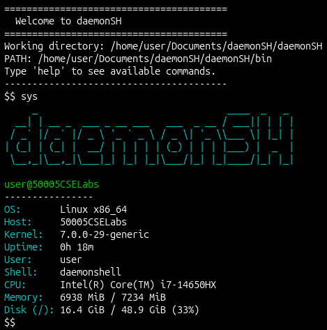

# daemonSH

A custom Unix shell in C built on top of the starter for SUTD 50.005's PA1
assignment, then taken well beyond the base requirements as a personal,
post-course rebuild.



## What it does

- **Real shell loop.** The starter shell ran exactly one command and exited
  (`execv` replaces the process image with no `fork`/loop around it). This
  implements the actual `fork` → `exec` → `wait` → re-prompt cycle, plus
  graceful handling of blank input and `Ctrl+D`.

- **Seven builtins**, run in-process (never forked, since things like `cd`
  need to persist in the shell's own state): `cd`, `help`, `exit`, `usage`,
  `env`, `setenv`, `unsetenv`.

- **`.daemonshellrc` startup config.** On launch, the shell reads
  `.daemonshellrc` from its working directory if present. Two directive
  types: `PATH=...` extends where external commands are looked up, and any
  other line is run as a startup command before the first prompt.

- **PATH is opt-in, not inherited.** By default the shell only knows its own
  bundled `bin/` programs plus the seven builtins — nothing from the host
  system's `PATH` is visible unless `.daemonshellrc` explicitly adds it.
  Bundled `bin/` always takes priority even when more directories are added,
  so a same-named system binary (e.g. `/usr/bin/ld`, the real linker) can
  never shadow this shell's own `ld`.

- **Seven bundled system programs** under `bin/`, built alongside the shell:
  - `find`, `ld`, `ldr` — from the original assignment scope.
  - `sys` — a small neofetch-style system info dump (OS, kernel, CPU,
    memory, disk, uptime), shown above.
  - `dspawn` — spawns a proper Unix daemon via the full double-fork,
    `setsid`, signal-handling, fd-redirection sequence, not just a
    backgrounded process.
  - `dcheck` — counts how many `dspawn` daemons are currently alive.
  - `backup` — zips whatever `$BACKUP_DIR` points to (a file or a
    directory) into a timestamped archive under `archive/`.

## Building and running

```bash
make            # builds ./daemonshell and everything under bin/
./daemonshell
```

## Testing

```bash
make test       # unit + integration
make unit       # Unity-based tests for pure helpers (perms, .daemonshellrc parsing)
make integration # black-box bash scripts that drive ./daemonshell as a subprocess
```

11 unit tests, 7 integration tests, all passing as of this writing.

## Layout
- source/ Shell loop, builtins, .daemonshellrc loader
- libs/ Pure, unit-testable helpers
- system_programs/ The seven bin/ programs
- includes/ Matching headers
- tests/
- unit/ Unity tests for source/libs/
- integration/ Bash scripts exercising the built shell end-to-end
- files/ Fixture data the integration tests run against

## Credit

Forked from [`natalieagus/cse-pa1-starter-template`](https://github.com/natalieagus/cse-pa1-starter-template),
the starter scaffold for SUTD 50.005's PA1. Everything beyond the original
one-shot shell and the three bundled programs (`find`/`ld`/`ldr`) is my own
solo rebuild, done after the course had concluded.
